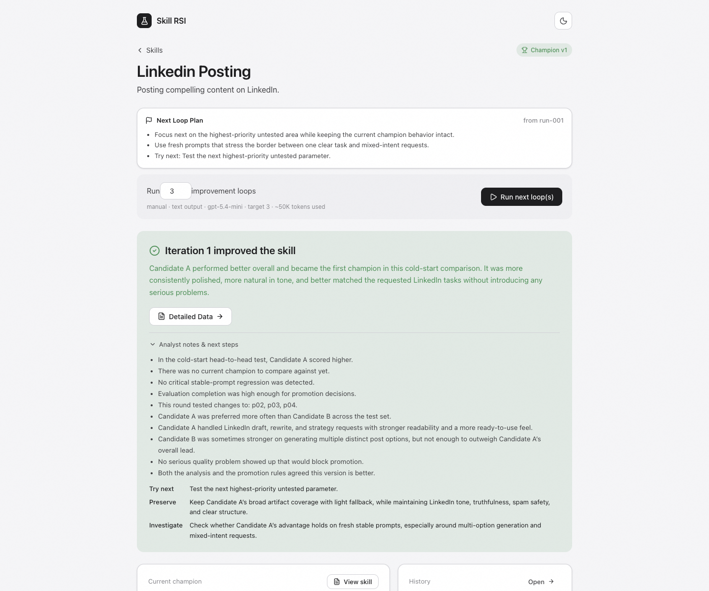
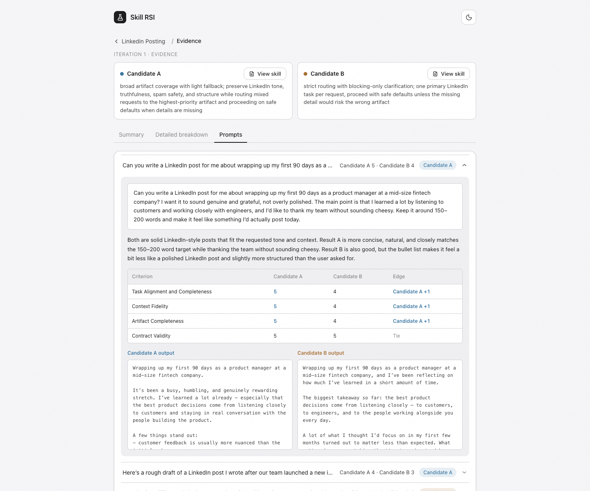
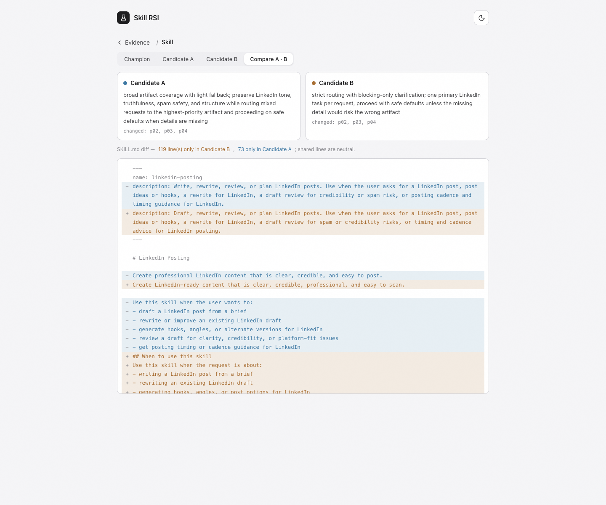
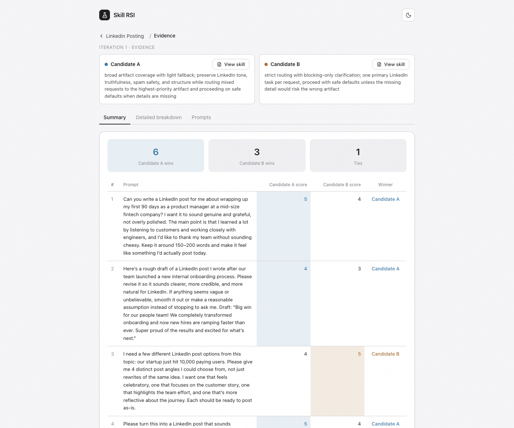
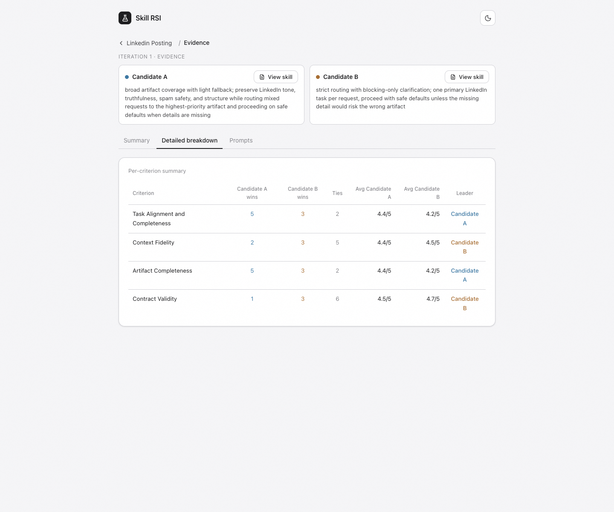
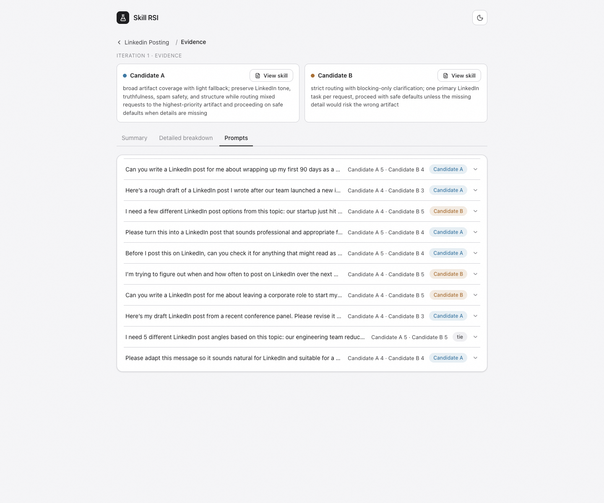
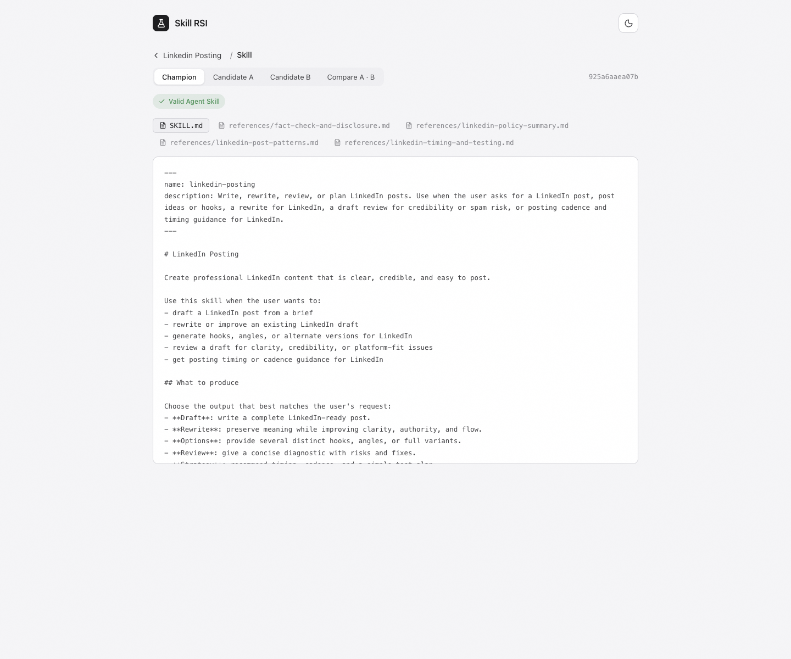
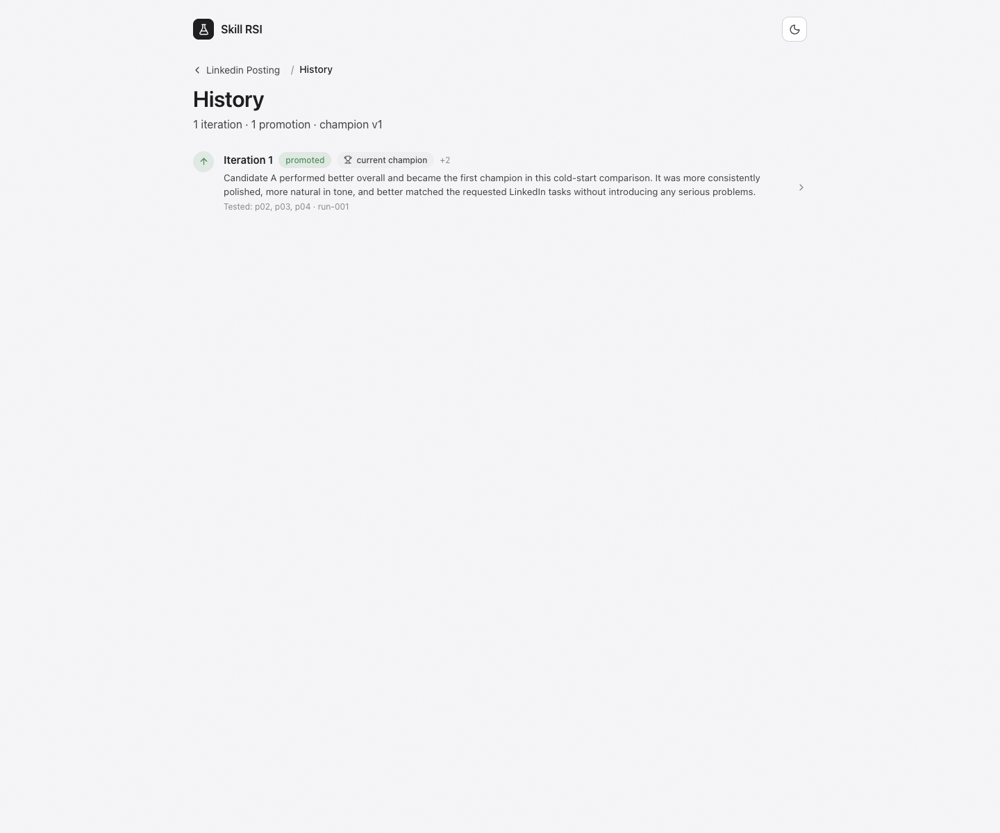

# Skill RSI

Recursive self-improvement for Agent Skills.

Given a skill goal, Skill RSI creates or imports an Agent Skill, evaluates it, and keeps improving it through controlled loops. A scratch project starts with a cold-start duel to crown the first champion. After that, each loop generates one focused challenger, evaluates it directly against the current champion, and promotes only when the challenger clears the promotion policy.



For the origin story, see [Open Sourcing SkillEval](https://www.justinwetch.com/blog/skilleval).

## Why

After building [SkillEval](https://github.com/justinwetch/SkillEval), the evaluation bottleneck moved upstream. Comparing two skills was useful, but deciding what to test next was still manual. Skill RSI closes that loop: it researches the domain, maps improvement surfaces, plans a focused experiment, creates a challenger, evaluates the result, and records what the next loop should try.

The human remains the goal setter and budget owner. The system does the repetitive hypothesis generation, variant creation, evaluation, and history keeping.

## Evidence-Backed Decisions

Every promotion decision links back to prompt-level evidence: the prompt, judge rationale, criterion scores, and both candidate outputs.



Skill RSI also keeps the candidate packages inspectable, so you can see what changed before accepting a new champion.



## UI Walkthrough

The summary view shows the head-to-head result at a glance.



The detailed breakdown explains where each candidate won across the criteria.



The prompt list keeps every judgment inspectable.



The champion skill can be opened directly from the UI.



The history view records the improvement trajectory over time.



## How It Works

For the canonical explanation of the loop and agent roles, see [docs/HOW_IT_WORKS.md](docs/HOW_IT_WORKS.md).

First scratch run:

```text
load project
  -> build research packet and ontology
  -> seed initial parameterization
  -> plan cold-start duel
  -> generate Candidate A and Candidate B
  -> adversarial preflight review
  -> evaluate Candidate A vs Candidate B
  -> crown first champion when evidence is usable
  -> write history and next-loop plan
```

Later runs, or baseline-upload projects:

```text
load champion and history
  -> deconstruct current champion into improvement parameters
  -> use ontology as domain guardrail, not as a rewrite brief
  -> plan one controlled challenger
  -> generate challenger as a localized ablation of the champion
  -> adversarial preflight review
  -> evaluate challenger vs champion
  -> promote or keep current champion
  -> write history and next-loop plan
```

Baseline uploads skip the initial ontology step and start from deconstructing the uploaded champion. Existing ontologies are reused or conservatively refreshed when the champion changes.

## Quick Start

```bash
git clone https://github.com/justinwetch/Skill-RSI.git
cd Skill-RSI
npm install
cp .env.example .env
```

Add your OpenAI key to `.env` for CLI/server use:

```bash
OPENAI_API_KEY=sk-...
```

Stub mode runs without API calls:

```bash
node src/cli.js init my-skill \
  --goal "Help agents write clear technical documentation." \
  --output text \
  --model gpt-5.4-mini \
  --target-iterations 3
node src/cli.js run my-skill --stub --loops 3
```

Start from an existing skill package:

```bash
node src/cli.js init my-skill \
  --goal "Improve this existing skill." \
  --baseline ./path/to/skill-or.zip
```

Real agentic run:

```bash
node src/cli.js run my-skill --agentic --real-eval --loops 1
```

Inspect results:

```bash
node src/cli.js status my-skill
node src/cli.js summary my-skill
node src/cli.js progress my-skill
node src/cli.js timeline my-skill
node src/cli.js report my-skill
node src/cli.js skill my-skill --source champion
```

## Local UI

Build and start the local server, then open [http://127.0.0.1:8765](http://127.0.0.1:8765):

```bash
npm run build:ui
npm run server
```

For hot-reload UI development, run these in separate terminals:

```bash
npm run server
npm run dev:ui
```

The UI supports:

- creating projects from scratch or from an uploaded skill folder, single `SKILL.md`, or zip
- output artifact selection: Text, Code, or Code + visuals
- OpenAI model selection at project creation: `gpt-5.4-mini` or `gpt-5.5`
- browser-local OpenAI API key entry, with `.env` as server fallback
- live loop progress, next-loop plan, detailed eval data, champion/challenger skill viewing, and visual screenshots when available

Model choice is fixed at project creation for cleaner run history. API keys are not stored in project config; the UI stores pasted keys locally in the browser.

## Operating Modes

Manual:

```bash
node src/cli.js run ux-design --agentic --real-eval --loops 1
```

Continuous:

```bash
node src/cli.js continuous ux-design --agentic --real-eval --max-runs 5 --patience 3 --max-inconclusive 2
```

Hook-triggered:

```bash
node src/cli.js hook ux-design --agentic --real-eval --event hook.json
```

For cron or macOS LaunchAgent setup, see [docs/SCHEDULING.md](docs/SCHEDULING.md).

## What A Run Produces

Cold start:

```text
runs/<run-id>/
├── deconstruction/
│   ├── research-packet.json
│   ├── ontology.json
│   ├── parameterization.json
│   └── experiment-plan.json
├── candidates/
│   ├── candidate-a/
│   └── candidate-b/
├── eval/
│   ├── config.json
│   └── candidate-duel.json
└── analysis/
    ├── recommendation.json
    └── report.md
```

Champion challenge:

```text
runs/<run-id>/
├── deconstruction/
│   ├── parameterization.json
│   └── experiment-plan.json
├── challenger/
├── eval/
│   ├── config.json
│   └── challenge.json
└── analysis/
    ├── recommendation.json
    └── report.md
```

Visual runs also persist rendered HTML, screenshots, render diagnostics, and screenshot references under the run's eval artifacts.

After a promotion, `champion/skill/` is updated and `history/current-summary.md` records what changed, what was learned, what not to repeat, and what the next loop should try.

## CLI Reference

```bash
# Project management
node src/cli.js doctor
node src/cli.js init <name> --goal "..." --output text|code|code_visual --model gpt-5.4-mini --target-iterations 3
node src/cli.js init <name> --goal "..." --baseline ./path/to/skill-or.zip
node src/cli.js projects
node src/cli.js status <project>
node src/cli.js delete <project>

# Running loops
node src/cli.js run <project> --stub --loops 3
node src/cli.js run <project> --agentic --real-eval --loops 1
node src/cli.js run <project> --agentic --real-eval --loops 1 --model gpt-5.5
node src/cli.js step <project>
node src/cli.js continuous <project> --agentic --real-eval --max-runs 5 --patience 3
node src/cli.js hook <project> --agentic --real-eval --event hook.json

# Inspection
node src/cli.js summary <project>
node src/cli.js progress <project>
node src/cli.js compare <project>
node src/cli.js timeline <project>
node src/cli.js report <project>
node src/cli.js run-detail <project>
node src/cli.js skill <project> --source champion
node src/cli.js skill <project> --source challenger --run latest --json
node src/cli.js export-skill <project> --source champion --out ./exported-skill
node src/cli.js inspect-skill <path/to/skill>

# Standalone evaluation
node src/cli.js evaluate <project> \
  --a ./skill-a --b ./skill-b \
  --prompts prompts.json --criteria criteria.json \
  --output text \
  --gen-model gpt-5.4-mini --judge-model gpt-5.4-mini \
  --out result.json

node src/cli.js evaluate <project> \
  --a ./skill-a --b ./skill-b \
  --prompts prompts.json --criteria criteria.json \
  --output code_visual \
  --visual-artifacts-dir ./visual-artifacts \
  --gen-model gpt-5.4-mini --judge-model gpt-5.4-mini \
  --out result.json

# Annotation, not required promotion
node src/cli.js decide <project> --decision annotate --note "Reviewed."
```

`init --output code_visual` checks local screenshot runner availability before creating the project. Run `node src/cli.js doctor` for OpenAI key status, supported model names, and visual runner diagnostics. Per-run model flags override project config and should be used intentionally because they make the run history less uniform.

## Project Workspace

All state lives under `.skill-rsi/projects/<name>/` as plain files.

```text
.skill-rsi/
└── projects/
    └── ux-design/
        ├── config.json
        ├── project.yaml
        ├── state.json
        ├── champion/skill/
        ├── ontology/current.json
        ├── parameterization/current.json
        ├── prompt-bank/
        ├── runs/
        └── history/
            ├── current-summary.md
            ├── index.json
            └── detailed/
```

`config.json` is the machine-readable source for triggers, budgets, promotion policy, eval policy, model choices, research policy, and portability. `project.yaml` is a compact human-readable companion.

Current UI-created model config:

```json
{
  "models": {
    "agent": "gpt-5.4-mini",
    "generation": "gpt-5.4-mini",
    "judge": "gpt-5.4-mini"
  }
}
```

## API Keys

CLI and local server runs load `.env` automatically:

```bash
OPENAI_API_KEY=sk-...
```

The UI can also use a pasted key saved locally in the browser. Project files store model names, not API keys.

## Visual Evaluation

`Code + visuals` projects require generated skills to produce complete standalone browser-renderable UI code. Skill RSI renders each output with Playwright/system Chromium, captures desktop/tablet/mobile screenshots, records render diagnostics, and sends the text plus images to the judge.

The product exposes `Code + visuals`, where the artifact is still browser-renderable code. Separate rendered-media generation is not part of the product surface.

## Built On

Skill RSI's evaluation engine is a headless adaptation of [SkillEval](https://github.com/justinwetch/SkillEval). Skill packages follow the [Agent Skills standard](https://agentskills.io/specification). For architecture and roadmap notes, see [IMPLEMENTATION_PLAN.md](IMPLEMENTATION_PLAN.md).

Built by [Justin Wetch](https://www.justinwetch.com)
